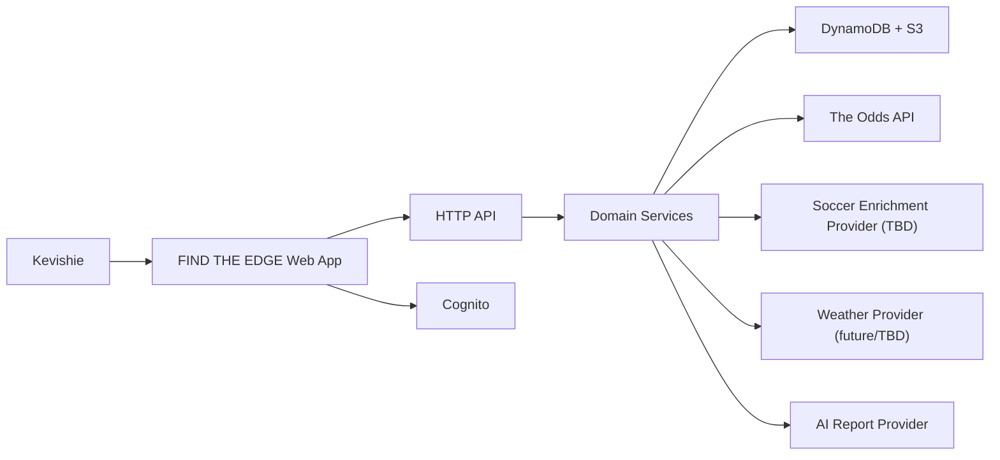
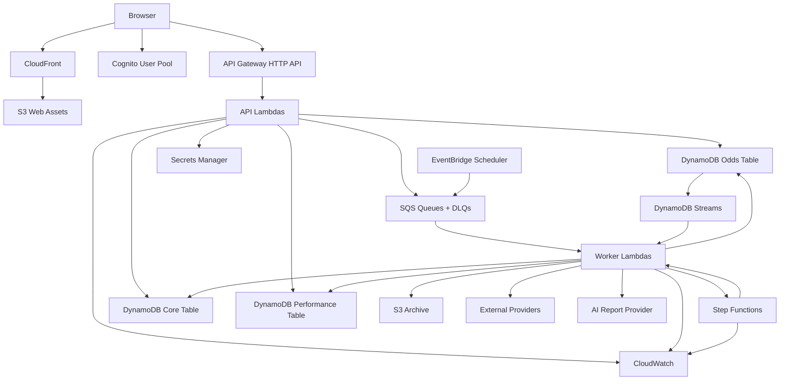
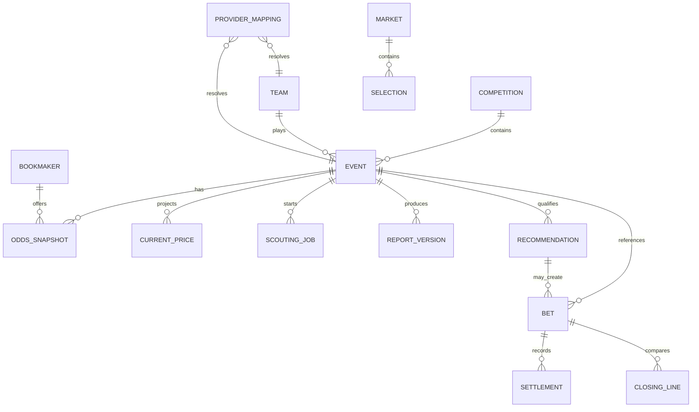
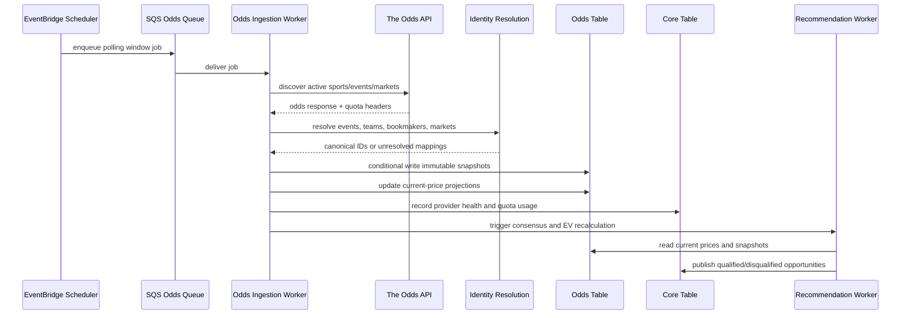
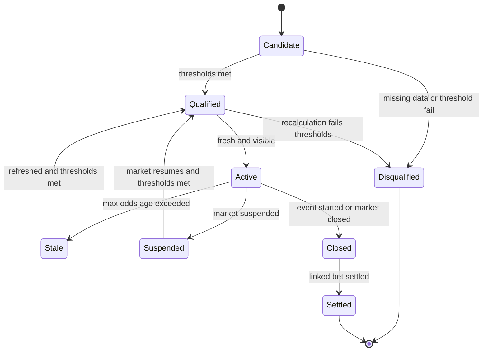
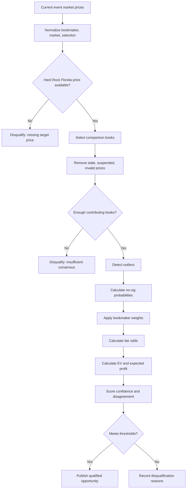
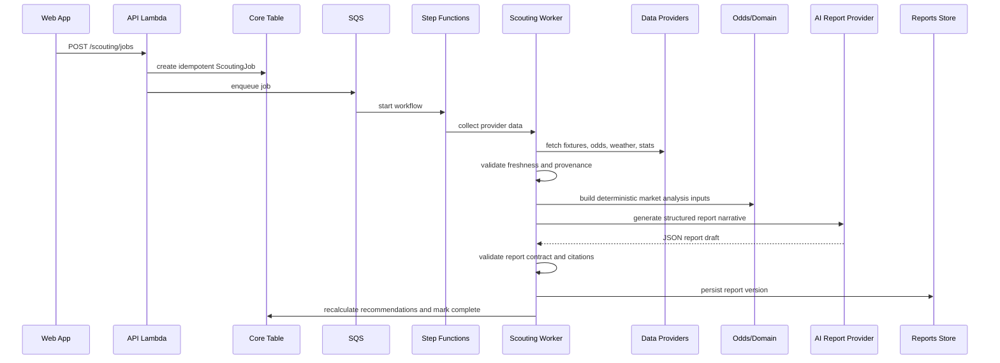

# System Architecture: FIND THE EDGE

## 0. Binding Multi-Sport Amendment (2026-07-26)

This section supersedes any soccer-first or MLB-specific architectural constraint elsewhere in this artifact. Soccer and MLB may be delivery priorities, but neither is the core domain. FIND THE EDGE is a sport-agnostic betting intelligence platform whose sport behavior is supplied by registered, versioned modules.

### 0.1 Architectural invariants

- Shared domain models, database keys, APIs, routes, pricing calculations, prompt composition, and evaluation infrastructure use stable sport, league, event, participant, market, strategy, and model identifiers.
- Shared `Event` has no pitcher, handedness, quarterback, formation, surface, set, or lineup-specific fields. Typed sport payloads own those attributes.
- Core pricing accepts generic market definitions and selections. A sport strategy determines whether a market is approved.
- A target sportsbook is configuration, not a domain constant.
- No provider is assumed to cover every sport, league, or capability.
- AI is optional and composable. Deterministic price, probability, EV, qualification, grading, CLV, and ROI remain outside prompts.
- Every scout, recommendation, pick, and evaluation stores `sportKey`, `sportModuleVersion`, `strategyVersion`, `calculationVersion`, and exact prompt bundle version when AI is used.
- Adding a sport requires a module, registration, market definitions, strategy, docs, and contract tests—not edits to core event or pricing code.

### 0.2 Layer model

```text
Core betting domain
  Sport, League, Season, Competition, Event, Participant, Venue
  Market, Selection, Sportsbook, OddsSnapshot, ConsensusPrice
  FairPrice, EV, Recommendation, Pick, Bet, Result, CLV, ROI
  ModelVersion, StrategyVersion, Freshness, ProviderHealth
          |
Sport module contract and registry
  MLB | Soccer | Tennis | NFL | NCAAF | future modules
          |
Strategy configurations
  Approved/prohibited markets, thresholds, confidence and recommendation policy
          |
Provider capability ports
  Odds | Schedule | Stats | Injury | Lineup | Weather | PublicBetting | Results
          |
Applications
  API | workers | web | optional LLM report synthesis
```

### 0.3 Repository boundaries

```text
packages/
  domain/       # universal entities, IDs, evidence, version references
  odds/         # sport-agnostic deterministic pricing and EV
  sports/       # SportModule contract, registry, and sport implementations
  scouting/     # prompt composition and structured scout contracts
  providers/    # capability-based provider ports/adapters
strategies/
  schema.json
  mlb/
  soccer/
  tennis/
  nfl/
  ncaaf/
prompts/
  shared/
  sports/
  strategies/
```

### 0.4 SportModule contract

Each module declares immutable sport mechanics and terminology:

- key, version, maturity, display name, leagues, participants, and event phases
- possible markets and grading mechanics
- required/optional data, scouting categories, and feature definitions
- fair-price and confidence methodology descriptors
- lineup/roster rules and live-betting capability
- validation, normalization, feature, evaluation, scout, output, and grading ports
- prompt section, output schema identifier, validation schema identifier, and UI labels

User/product preferences live in a separately versioned strategy. Strategy owns approved/prohibited markets, thresholds, target book, public-fade policy, and recommendation preferences.

### 0.5 Universal storage and APIs

All primary records include `sportKey`. Event keys are shaped from stable IDs such as `SPORT#{sportKey}#EVENT#{eventId}`; no key embeds team-vs-player or sport-specific semantics. Sport detail is stored as a versioned payload with `schemaId`, `schemaVersion`, and module-owned validation.

Generic API paths use `/sports/:sportKey/events/:eventId`, `/sports/:sportKey/opportunities`, and `/sports/:sportKey/scouts`. The UI resolves terminology and sport panels through registry metadata. Shared screens never branch on `sportKey`; modules contribute configuration or components through registered extension points.

### 0.6 Provider capability model

Provider interfaces are capability-specific: `OddsProvider`, `ScheduleProvider`, `StatsProvider`, `InjuryProvider`, `LineupProvider`, `WeatherProvider`, `PublicBettingProvider`, and `ResultsProvider`. Each adapter declares supported sports, leagues, markets, rate limits, expected freshness, and quality tier. Orchestration resolves providers by capability and declared coverage.

### 0.7 Module maturity

Modules declare `planned`, `experimental`, `beta`, or `production`. Maturity is visible in APIs and UI and cannot be inferred from folder presence. Initial targets:

- MLB: beta
- Soccer: experimental
- Tennis: planned
- NFL: planned
- NCAAF: planned

### 0.8 Compatibility note

The older soccer-first sections below document the original delivery plan. Where they prescribe soccer-specific shared models, routes, providers, or core behavior, this amendment wins. Sport-specific soccer details remain useful input to the soccer module.

## 1. Architecture Purpose

This document defines the initial system architecture for FIND THE EDGE, a private, soccer-first sports betting intelligence web application. It is the build substrate for later UX, epics, stories, and implementation. It does not scaffold the application, create infrastructure, install dependencies, or write production code.

The Product Brief and PRD are binding source inputs. The architecture preserves the Hard Rock Bet Florida focus, soccer-first MVP, DynamoDB direction, Agon-aligned AWS serverless stack, immutable odds history, deterministic betting calculations, data provenance, and unresolved soccer enrichment provider decision.

## 2. Architecture Thesis

FIND THE EDGE should use a hexagonal, event-driven serverless architecture:

- Domain packages own canonical entities, pure betting calculations, and lifecycle rules.
- Provider adapters translate external APIs into normalized domain inputs.
- Application services orchestrate ingestion, scouting, recommendations, bets, and reports.
- DynamoDB stores access-pattern-specific operational records and immutable odds history.
- SQS, Step Functions, EventBridge Scheduler, and DynamoDB Streams isolate provider failures and asynchronous workflows.
- React surfaces query server state through typed API boundaries and never performs authoritative betting calculations.
- AI is a narrative and synthesis layer only; it cannot invent facts or perform authoritative betting math.

This keeps the MVP operationally small while giving clean extension points for NFL, NBA, esports, automatic scouting, additional users, and additional providers later.

## 3. Current Technology Fit Checks

The required stack is inherited from the Product Brief and PRD. Current public documentation checks found:

- Vite is still the intended frontend build tool, but current Vite documentation requires Node.js `20.19+` or `22.12+`. The architecture therefore sets the runtime floor to Node.js `>=20.19` and recommends the current supported LTS line available when scaffolding.
- TanStack Router remains a type-safe React router with file-based routing, typed navigation, route loaders, and error boundaries.
- AWS CDK v2 remains the current AWS infrastructure-as-code direction.
- Node.js production applications should use Active LTS or Maintenance LTS releases; implementation should avoid an end-of-life Node line even though the PRD says Node 20 or newer.

No exact package versions are pinned in this architecture because no application code or package manifests are being created in this task.

## 4. System Context



## 5. AWS Deployment Architecture



## 6. Repository Structure and Dependency Rules

```text
apps/
  web/              # React/Vite frontend, routes, API client usage, feature screens
  api/              # Lambda HTTP handlers, request validation, auth context, response envelopes
  workers/          # Ingestion, projection, scouting, recommendation, archival workers
packages/
  domain/           # Canonical entities, value objects, lifecycles, pure business rules
  odds/             # Pure betting math, consensus, EV, CLV, movement, outlier rules
  scouting/         # Scouting report contracts, validation, section rules, AI boundary contracts
  providers/        # Provider adapter interfaces and provider-specific implementations
  database/         # DynamoDB key builders, repositories, item mappers, pagination helpers
  auth/             # Auth context, Cognito token utilities, permission claims
  config/           # Typed environment and runtime configuration
  observability/    # Logger, metrics, correlation IDs, provider request logging
  ui/               # Shared shadcn/ui wrappers, layout primitives, visual tokens
  test-utils/       # Test fixtures, fake providers, DynamoDB/local helpers
infra/
  cdk/              # AWS CDK app, stacks, constructs, deployment configuration
docs/               # Human-facing project docs
_bmad/              # BMAD installation
_bmad-output/       # Planning artifacts
```

Dependency rules:

- `packages/domain` depends on no application, AWS, React, provider DTO, database, or LLM package.
- `packages/odds` depends only on `domain` when domain value types are needed; it must remain pure and deterministic.
- `packages/scouting` may depend on `domain` and `odds` output types, but not provider DTOs or React.
- `packages/providers` may depend on `domain`, `odds` input types, `config`, and `observability`; provider-specific DTOs stay inside provider subpackages.
- `packages/database` may depend on `domain` and `scouting` contracts for mapping, but domain packages cannot depend on database.
- `apps/api` and `apps/workers` compose `domain`, `odds`, `providers`, `database`, `auth`, `config`, and `observability`.
- `apps/web` depends on typed API client contracts, `ui`, and frontend validation schemas. It cannot import `database`, provider implementations, AWS SDK code, or authoritative betting calculation internals.
- `infra/cdk` can reference package names and environment contracts but cannot import runtime business logic.
- Circular dependencies are disallowed. Shared contracts move downward into `domain`, `odds`, or `scouting` instead of upward into app packages.

## 7. Core Bounded Modules

| Module | Responsibility | Primary Package |
| --- | --- | --- |
| Authentication | Cognito-backed identity, private access, future role claims | `auth`, `api` |
| Sports Catalog | Sports and sport enablement | `domain`, `providers` |
| Competitions | Canonical competition model and settings | `domain`, `database` |
| Teams | Canonical teams and aliases | `domain`, `database` |
| Events | Canonical event lifecycle and status | `domain`, `database` |
| Provider Entity Mappings | Provider ID to internal ID resolution | `domain`, `database`, `providers` |
| Bookmakers | Canonical bookmaker registry and weights | `domain`, `database` |
| Markets | Canonical markets and supported MVP market list | `domain` |
| Selections | Canonical outcomes within markets | `domain` |
| Odds Snapshots | Immutable odds records | `domain`, `database`, `workers` |
| Consensus Pricing | No-vig and weighted fair probability | `odds` |
| Expected Value | EV, expected profit, Kelly | `odds` |
| Line Movement | Movement, stale gaps, significant movement | `odds`, `database` |
| Watchlists | User-curated event priority | `domain`, `database`, `api` |
| Scouting Jobs | Idempotent async job lifecycle | `domain`, `scouting`, `workers` |
| Scouting Reports | Structured report contract and validation | `scouting`, `database` |
| Report Versions | Immutable report version records | `scouting`, `database` |
| Recommendations | Candidate and qualified opportunity lifecycle | `domain`, `odds`, `database` |
| Bets | Manual bet entries | `domain`, `database`, `api` |
| Settlements | Result, payout, profit/loss | `domain`, `odds` |
| Closing Line Value | CLV calculation and benchmark status | `odds` |
| Performance | ROI, CLV, market and competition summaries | `domain`, `database` |
| Provider Health and Quota | Provider status, usage, failures | `providers`, `database`, `observability` |
| User Settings | Target sportsbook, thresholds, weights, timezone | `domain`, `database`, `api` |

## 8. DynamoDB Design

### 8.1 Table Strategy

The MVP uses three purpose-built DynamoDB tables:

1. `FindTheEdgeCore` for events, settings, mappings, watchlists, scouting jobs, reports, recommendations, and provider health.
2. `FindTheEdgeOdds` for immutable odds snapshots, current-price projections, and odds history.
3. `FindTheEdgePerformance` for bets, settlements, closing lines, ROI, CLV, and aggregates.

This avoids a speculative single-table design while still keeping operational complexity low. Normal application flows must use primary keys or GSIs; table scans are not allowed for regular reads.

### 8.2 Core Application Table

Table: `FindTheEdgeCore`

| Item Type | PK | SK | Notes |
| --- | --- | --- | --- |
| Competition | `SPORT#soccer` | `COMPETITION#{competitionId}` | Canonical competition |
| Team | `SPORT#soccer` | `TEAM#{teamId}` | Canonical team |
| Event | `EVENT#{eventId}` | `META` | Canonical event |
| Event Competition Link | `COMPETITION#{competitionId}` | `EVENT#{kickoffIso}#{eventId}` | Competition event list |
| Provider Mapping | `MAPPING#{providerName}` | `{entityType}#{providerEntityId}` | Provider ID to internal ID |
| Manual Mapping Override | `MAPPING_OVERRIDE#{entityType}` | `{providerName}#{providerEntityId}` | Human override |
| Watchlist | `USER#{userId}` | `WATCHLIST#EVENT#{eventId}` | Watched events |
| Scouting Job | `EVENT#{eventId}` | `SCOUT_JOB#{jobId}` | Async job state |
| Scouting Job Idempotency | `IDEMPOTENCY#SCOUT#{hash}` | `JOB` | Duplicate prevention |
| Report Head | `EVENT#{eventId}` | `REPORT#{reportId}` | Latest report pointer |
| Report Version | `REPORT#{reportId}` | `VERSION#{versionNo}` | Report version metadata |
| Recommendation | `EVENT#{eventId}` | `RECOMMENDATION#{opportunityId}` | Candidate/qualified opportunities |
| Settings | `USER#{userId}` | `SETTINGS` | User settings |
| Provider Health | `PROVIDER#{providerName}` | `HEALTH#{timestamp}` | Status and quota usage |

GSIs:

- `GSI1`: `GSI1PK`, `GSI1SK` for upcoming events by sport/status/date, such as `UPCOMING#soccer#scheduled` -> `{kickoffIso}#{eventId}`.
- `GSI2`: `GSI2PK`, `GSI2SK` for active recommendations, such as `ACTIVE_OPPORTUNITY#soccer` -> `{rankScore}#{opportunityId}`.
- `GSI3`: `GSI3PK`, `GSI3SK` for scouting jobs by status, such as `SCOUT_JOB_STATUS#queued` -> `{createdAt}#{jobId}`.
- `GSI4`: `GSI4PK`, `GSI4SK` for provider mappings by internal ID, such as `INTERNAL#{entityType}#{internalId}` -> `{providerName}#{providerEntityId}`.

Main access patterns:

- Get event detail by `EVENT#{eventId}`.
- List upcoming soccer events by status/date through `GSI1`.
- List events for a competition through `COMPETITION#{competitionId}`.
- Resolve provider IDs through mapping keys.
- List watched events by `USER#{userId}` prefix.
- Get latest and historical scouting reports by event/report keys.
- List active opportunities through `GSI2`.
- List queued/in-progress scouting jobs through `GSI3`.
- Read and write user settings.
- Read provider health and quota status.

Conditional writes:

- Event upserts require version or timestamp checks to prevent older provider payloads from overwriting newer canonical state.
- Scouting job creation uses `attribute_not_exists(PK)` on the idempotency item.
- Manual mapping overrides require explicit user or admin context.
- Report version writes require version number not to exist.

Idempotency strategy:

- Ingestion uses provider, endpoint, sport, market set, and provider timestamp or response hash.
- Scout Event uses `eventId`, selected provider data snapshot IDs, report intent, and request idempotency key.
- Settings updates use optimistic version checks.

TTL usage:

- Keep provider health detail and transient idempotency records with TTL.
- Do not TTL canonical events, settings, mappings, report versions, or recommendations until retention policy is decided.

S3 archival:

- Archive raw provider response excerpts, large report payloads if they grow beyond DynamoDB comfort, and long-term provider health logs to S3.
- DynamoDB items store S3 object pointers and content hashes.

Hot-partition risks:

- `ACTIVE_OPPORTUNITY#soccer` can become hot if refreshed frequently. Use coarse rank buckets or date partitions if write volume grows.
- `SPORT#soccer` can grow large. Use competition/date access patterns for normal reads.

Pagination:

- All list endpoints use `limit` and encoded DynamoDB `LastEvaluatedKey` cursors.
- Cursors are opaque to the client.

### 8.3 Odds Table

Table: `FindTheEdgeOdds`

| Item Type | PK | SK | Notes |
| --- | --- | --- | --- |
| Odds Snapshot | `EVENT#{eventId}` | `SNAPSHOT#{marketKey}#{selectionKey}#{bookmakerId}#{collectedAt}#{snapshotId}` | Immutable |
| Current Price Projection | `EVENT#{eventId}` | `CURRENT#{marketKey}#{selectionKey}#{bookmakerId}` | Mutable projection |
| Market History Pointer | `MARKET#{eventId}#{marketKey}` | `TS#{collectedAt}#{selectionKey}#{bookmakerId}` | Query helper |
| Bookmaker Event Price | `BOOKMAKER#{bookmakerId}` | `EVENT#{eventId}#{marketKey}#{selectionKey}` | Latest lookup |
| Consensus Result | `EVENT#{eventId}` | `CONSENSUS#{marketKey}#{selectionKey}#{algorithmVersion}` | Derived |
| Opportunity Price Input | `OPPORTUNITY#{opportunityId}` | `INPUT#{snapshotId}` | Audit |

Current Price Projection items are maintained from immutable Odds Snapshot writes. The MVP can update the projection in the ingestion worker after a successful conditional snapshot write, but the preferred architecture is a DynamoDB Streams projection worker so replay, deduplication, and later projection rebuilds use the same path.

GSIs:

- `GSI1`: `GSI1PK=BOOKMAKER#{bookmakerId}`, `GSI1SK={sport}#{kickoffIso}#{eventId}#{marketKey}` for bookmaker-specific views.
- `GSI2`: `GSI2PK=MARKET#{eventId}#{marketKey}`, `GSI2SK={collectedAt}#{bookmakerId}#{selectionKey}` for market history.
- `GSI3`: `GSI3PK=STALE_CANDIDATE#{bucket}`, `GSI3SK={expiresAt}#{eventId}#{marketKey}` for stale opportunity cleanup if needed.

Main access patterns:

- Query all current odds for an event.
- Query odds history for an event/market/selection.
- Query latest Hard Rock Florida price for event/market/selection.
- Query comparison bookmaker prices for consensus.
- Query bookmaker coverage by event and market.
- Reconstruct calculation inputs for an opportunity.

Conditional writes:

- Odds Snapshot writes use `attribute_not_exists(PK, SK)` and content hash idempotency.
- Current Price Projection updates require incoming Collection Timestamp >= stored Collection Timestamp.
- Consensus Result writes include algorithm version and input snapshot hash.

Idempotency strategy:

- Snapshot ID is derived from provider, provider event ID, bookmaker, market, selection, odds value, Provider Timestamp, and Collection Timestamp bucket or response hash.
- Current projection update is idempotent when the same snapshot stream record is processed more than once.

TTL usage:

- Current projection items do not use TTL; they are updated or marked stale.
- Raw high-frequency snapshot retention is an open decision. Until resolved, do not apply TTL to immutable MVP snapshots. Use archival for cost control if needed.

S3 archival:

- Archive raw odds provider responses and aged snapshot batches after retention policy is decided.
- Keep enough DynamoDB metadata to reconstruct active recommendations and CLV inputs.

Hot-partition risks:

- Popular event partitions may receive many writes near kickoff. MVP avoids high-frequency continuous polling and uses adaptive polling windows.
- If a single event becomes hot, snapshot writes can shard by market in the PK in a future migration.

Pagination:

- Odds history endpoints page by `collectedAt`.
- Event odds endpoints page market groups if an event has unusually large coverage.

### 8.4 Performance Table

Table: `FindTheEdgePerformance`

| Item Type | PK | SK | Notes |
| --- | --- | --- | --- |
| Bet | `USER#{userId}` | `BET#{placedAt}#{betId}` | Manual bet entry |
| Bet By Event | `EVENT#{eventId}` | `BET#{placedAt}#{betId}` | Event lookup |
| Settlement | `BET#{betId}` | `SETTLEMENT#{settledAt}` | Result history |
| Closing Line | `BET#{betId}` | `CLOSING_LINE#{benchmark}#{timestamp}` | CLV input |
| Performance Aggregate | `USER#{userId}` | `AGG#{period}#{dimension}#{key}` | ROI/CLV summaries |
| Recommendation Link | `OPPORTUNITY#{opportunityId}` | `BET#{betId}` | Recommended vs manual |

GSIs:

- `GSI1`: `GSI1PK=BET_STATUS#{status}`, `GSI1SK={eventTime}#{betId}` for open bet settlement workflows.
- `GSI2`: `GSI2PK=PERFORMANCE#{dimension}#{key}`, `GSI2SK={period}#{userId}` for reporting.
- `GSI3`: `GSI3PK=EVENT#{eventId}`, `GSI3SK={placedAt}#{betId}` if event lookup cannot use primary item duplication.

Main access patterns:

- List user bets by date.
- Get bet by ID.
- List open bets.
- Settle a bet.
- Compute or read aggregates by market, competition, confidence bucket, recommended/manual source.
- Read CLV for settled bets.

Conditional writes:

- Bet creation requires unique `betId`.
- Settlement update uses optimistic versioning.
- Aggregate updates are idempotent by event id or settlement id.

Idempotency strategy:

- Bet creation from opportunity uses `opportunityId` plus user-supplied placement timestamp unless user explicitly creates multiple bets.
- Settlement writes use settlement idempotency keys.

TTL usage:

- No TTL on bets, settlements, closing lines, or aggregates for MVP.

S3 archival:

- Long-term bet exports and aggregate snapshots can be archived to S3 later.

Hot-partition risks:

- Single-user MVP keeps risk low. Future multi-user scale may partition aggregates by user and period.

Pagination:

- Bet lists page by placement timestamp.
- Performance reports page detailed rows and return aggregate summaries separately.

### 8.5 DynamoDB Access Pattern View



## 9. Canonical Identity and Provider Mapping

Internal IDs are the primary domain IDs. Provider IDs are external aliases.

Identity model:

```text
Internal Event ID
  <-> The Odds API event ID
  <-> Soccer enrichment provider fixture ID (TBD)

Internal Team ID
  <-> The Odds API team name or ID if available
  <-> Soccer enrichment provider team ID (TBD)

Internal Competition ID
  <-> The Odds API sport/league key
  <-> Soccer enrichment provider competition ID (TBD)
```

Rules:

- Provider IDs never become primary keys for domain entities.
- Provider mappings store source provider, provider ID, normalized name, confidence, match method, timestamps, and override status.
- Automatic matching can use normalized names, kickoff time, competition, home/away teams, venue, and provider confidence.
- Failed automatic matches create unresolved mapping records and block enrichment merge until resolved.
- Manual mapping overrides supersede automatic matches and are audit logged.

Special cases:

- Different team names: store aliases per provider and canonical team display name.
- Competition naming differences: map provider competition keys to internal competition IDs and preserve provider labels.
- Kickoff changes: update canonical event kickoff with provenance and keep prior kickoff in event history.
- Postponements/cancellations: model as event status changes, not deletes.
- Neutral venues: represent venue neutrality as an explicit event attribute with provenance.
- Duplicate events: resolve to one internal event where confidence is sufficient; otherwise keep separate and flag.
- Provider ID changes: create new provider mapping entry linked to the same internal ID after resolution.
- Soccer enrichment provider unresolved: use adapter contracts and normalized domain returns rather than vendor-specific DTOs.

## 10. Provider Abstractions

Provider-specific DTOs must remain inside provider packages. Application and domain layers consume normalized return types.

Representative TypeScript interfaces:

```ts
export interface OddsProvider {
  listSports(): Promise<ProviderResult<SportSummary[]>>;
  listEvents(input: OddsEventQuery): Promise<ProviderResult<ProviderEvent[]>>;
  getEventOdds(input: EventOddsQuery): Promise<ProviderResult<ProviderOddsSnapshotBatch>>;
  getUsage(): Promise<ProviderUsage | null>;
}

export interface EventProvider {
  listFixtures(input: FixtureQuery): Promise<ProviderResult<ProviderFixture[]>>;
  getFixture(input: FixtureLookup): Promise<ProviderResult<ProviderFixtureDetail>>;
}

export interface ScoutingDataProvider {
  getTeamProfile(input: TeamLookup): Promise<ProviderResult<TeamProfile>>;
  getLineups(input: EventLookup): Promise<ProviderResult<LineupStatus>>;
  getInjuries(input: EventLookup): Promise<ProviderResult<InjuryReport>>;
  getStatistics(input: EventLookup): Promise<ProviderResult<MatchStatistics>>;
}

export interface WeatherProvider {
  getForecast(input: VenueForecastQuery): Promise<ProviderResult<WeatherSnapshot>>;
}

export interface IdentityResolutionService {
  resolveEvent(input: ProviderEventIdentity): Promise<IdentityResolution<EventId>>;
  resolveTeam(input: ProviderTeamIdentity): Promise<IdentityResolution<TeamId>>;
  resolveCompetition(input: ProviderCompetitionIdentity): Promise<IdentityResolution<CompetitionId>>;
}

export interface AIReportProvider {
  generateScoutingReport(input: AIReportInput): Promise<AIReportResult>;
}
```

Normalized return types must include:

- `sourceProvider`
- `providerEntityId` when available
- `providerTimestamp` when available
- `collectedAt`
- `verificationStatus`
- `freshness`
- `confidence`
- `rawRef` or S3 pointer when raw payload retention is needed

The Odds API initially supplies sports, events with betting markets, bookmakers, markets, prices, scores when used, and usage/quota headers. The future soccer enrichment provider should supply fixtures, teams, venues, rosters, lineups, injuries, suspensions when available, team statistics, player statistics, and match statistics.

## 11. Odds Ingestion Workflow



Flow:

1. Discover active sports.
2. Discover upcoming soccer events with betting markets.
3. Fetch featured markets.
4. Fetch event-specific markets when a watched event, near-kickoff event, or manual scouting flow requires detail.
5. Normalize bookmaker, market, selection, event, team, and odds data.
6. Write immutable Odds Snapshots.
7. Update Current Price Projection from the newest valid snapshot.
8. Recalculate consensus and EV.
9. Publish Qualified Opportunities or disqualification records.
10. Record provider quota usage and provider health.

Polling approach:

- MVP uses configurable polling windows based on time to kickoff.
- Far from kickoff: low-frequency polling.
- Same day: moderate polling for enabled competitions and watched events.
- Near kickoff: more frequent but bounded polling.
- Manual event detail and Scout Event can trigger targeted refresh.
- No continuous high-frequency polling in MVP.

Caching and deduplication:

- Cache provider responses by endpoint, normalized query, and short TTL where safe.
- Deduplicate requests by sport, event, market set, and polling window.
- Use idempotency keys for ingestion jobs and snapshot writes.

Retry and failure:

- Use exponential backoff with jitter for provider timeouts and transient errors.
- Send exhausted jobs to DLQ.
- Record partial responses and do not infer missing markets.
- Suspended markets remain visible in history but are excluded from active qualification.
- Provider quota exhaustion pauses non-critical polling and surfaces health status.

Stale-data behavior:

- Current projections track `expiresAt` based on maximum odds age.
- Stale projections cannot back Active +EV Opportunities.
- Stale history remains available with warning state.

## 12. Betting Calculation Architecture

`packages/odds` owns all authoritative betting calculations. It has no AWS, provider, database, React, or LLM dependencies.

Pure functions:

- `americanToDecimal`
- `decimalToAmerican`
- `impliedProbability`
- `twoWayNoVigProbability`
- `threeWayNoVigProbability`
- `weightedConsensusProbability`
- `fairOdds`
- `expectedValue`
- `expectedProfit`
- `kellyFraction`
- `fractionalKelly`
- `lineMovement`
- `closingLineValue`
- `detectOutliers`
- `marketDisagreementScore`

Rules:

- Hard Rock Florida is excluded from the default consensus when it is the target sportsbook.
- Rounding happens only at display boundaries. Internal calculations use decimal precision helpers and fixed rounding policy at output.
- Every calculation validates inputs and returns typed success/failure results rather than throwing for normal invalid market data.
- Missing books, suspended markets, missing selections, stale prices, and invalid odds produce disqualification inputs rather than fabricated values.
- Algorithm and model versions are stored with consensus, EV, opportunity, and report outputs.

Test strategy:

- Unit tests cover known conversion examples, no-vig two-way and three-way markets, weighted consensus, EV, expected profit, fractional Kelly, CLV, outlier detection, and disagreement scoring.
- Property-style tests cover odds conversion round trips within accepted tolerance.
- Golden fixtures preserve known market examples across algorithm version changes.

## 13. +EV Opportunity Lifecycle



Qualification inputs:

- Target sportsbook odds from Hard Rock Florida.
- Consensus probability excluding target sportsbook by default.
- Minimum contributing books.
- Maximum odds age.
- Minimum EV.
- Outlier rules.
- Market disagreement score.
- Confidence.
- Scouting status.
- Market status and event status.

Disqualification reasons:

- Missing Hard Rock Florida odds.
- Too few Comparison Bookmakers.
- Stale target or comparison odds.
- Suspended or incomplete market.
- Missing required selection.
- EV below threshold.
- Outlier policy excluded required prices.
- Market disagreement above warning or block threshold.
- Event started, postponed, cancelled, or closed.
- Provider health prevents safe qualification.

Stale opportunities must not remain active. A stale opportunity can remain visible in history with the stale state and last valid calculation inputs.

## 14. +EV Calculation Flow



## 15. Manual Scouting Architecture



Job states:

- `queued`
- `in_progress`
- `completed`
- `failed_retryable`
- `failed_terminal`
- `cancelled`

Rules:

- Duplicate prevention uses `eventId`, input snapshot IDs, report intent, and request idempotency key.
- Retry creates a new attempt linked to the original job.
- Provider partial data can produce a report only when unavailable states and provenance are explicit.
- Timeouts fail the job with retryable status unless repeated attempts exceed policy.
- Each completed run creates a report version with model version, prompt version, provider data refs, associated Odds Snapshot refs, generation time, and changes from the previous report.
- Re-scouting after lineup release or major odds movement creates a new version, not a mutation.
- EventBridge schedules are post-MVP but can enqueue the same job command later.

## 16. AI-Assisted Scouting Boundary

Deterministic responsibilities:

- Odds normalization.
- Probability calculations.
- EV.
- CLV.
- Market qualification.
- Data freshness.
- Scouting job state.
- Report validation.

Provider-backed responsibilities:

- Fixtures.
- Odds.
- Venues.
- Weather.
- Injuries.
- Lineups.
- Statistics.
- Results.

AI-assisted responsibilities:

- Summaries.
- Tactical synthesis.
- Matchup explanation.
- Risk explanation.
- X-Factor analysis.
- Narrative report generation.
- Explaining why a market may be mispriced using verified inputs.

The AI must not invent unavailable facts or perform authoritative betting calculations.

Structured JSON report contract:

```ts
export interface ScoutingReportDocument {
  reportId: string;
  eventId: string;
  version: number;
  generatedAt: string;
  modelVersion: string;
  promptVersion: string;
  sections: ScoutingReportSection[];
  deterministicInputs: MarketAnalysisRef[];
  sourceRefs: SourceRef[];
  validation: ReportValidationResult;
}

export interface ScoutingReportSection {
  key:
    | "match_snapshot"
    | "venue_weather"
    | "team_scouting"
    | "tactical_matchup"
    | "player_matchups"
    | "x_factor_cinderella_check"
    | "betting_market_analysis"
    | "line_movement"
    | "advanced_metrics"
    | "historical_trends"
    | "market_edge"
    | "risk_assessment"
    | "final_plays"
    | "nuke_or_pass";
  title: string;
  facts: ReportFact[];
  narrative: string;
  confidence: "high" | "medium" | "low";
  freshness: "fresh" | "stale" | "unavailable" | "mixed";
}

export interface ReportFact {
  statement: string;
  sourceRefId: string | null;
  verificationStatus: "verified" | "unavailable" | "inferred" | "stale" | "conflicting";
  providerTimestamp?: string;
  collectedAt: string;
  confidence: "high" | "medium" | "low";
}
```

## 17. API Design

All API boundaries use Zod validation. Responses use a consistent envelope with `data`, `error`, `requestId`, and optional `page`.

Error model:

```json
{
  "error": {
    "code": "VALIDATION_ERROR | UNAUTHORIZED | FORBIDDEN | NOT_FOUND | CONFLICT | STALE_DATA | PROVIDER_UNAVAILABLE | RATE_LIMITED | INTERNAL",
    "message": "Human-readable safe message",
    "details": {}
  },
  "requestId": "correlation id"
}
```

Endpoint categories:

| Category | Method and Route | Request | Response | Auth | Pagination | Idempotency |
| --- | --- | --- | --- | --- | --- | --- |
| Auth Context | `GET /auth/session` | none | user, roles, session expiry | Cognito | none | no |
| Sports | `GET /sports` | filters | enabled sports | Cognito | cursor | no |
| Competitions | `GET /competitions` | sport, enabled | competitions | Cognito | cursor | no |
| Events | `GET /events` | date, competition, status, watchlist | event list | Cognito | cursor | no |
| Event Details | `GET /events/{eventId}` | path | event detail | Cognito | none | no |
| Event Odds | `GET /events/{eventId}/odds` | market filters | current odds | Cognito | cursor by market | no |
| Odds History | `GET /events/{eventId}/odds/history` | market, selection, bookmaker, cursor | history | Cognito | cursor | no |
| Opportunities | `GET /opportunities` | status, sport, filters | ranked opportunities | Cognito | cursor | no |
| Watchlist | `POST /watchlist/events/{eventId}` | none | watchlist item | Cognito | none | idempotent by event/user |
| Watchlist | `DELETE /watchlist/events/{eventId}` | none | empty success | Cognito | none | idempotent |
| Scouting Jobs | `POST /scouting/jobs` | eventId, options, idempotencyKey | job | Cognito | none | required |
| Scouting Jobs | `GET /scouting/jobs/{jobId}` | path | job status | Cognito | none | no |
| Reports | `GET /events/{eventId}/reports` | cursor | report heads | Cognito | cursor | no |
| Report Version | `GET /reports/{reportId}/versions/{version}` | path | report version | Cognito | none | no |
| Bets | `GET /bets` | status, date range | bets | Cognito | cursor | no |
| Bets | `POST /bets` | bet fields | bet | Cognito | none | optional idempotency |
| Bet Settlement | `POST /bets/{betId}/settlement` | status, payout, closing odds | settlement | Cognito | none | required |
| Performance | `GET /performance` | period, dimensions | summaries | Cognito | cursor for details | no |
| Settings | `GET /settings` | none | settings | Cognito | none | no |
| Settings | `PUT /settings` | settings versioned payload | settings | Cognito | none | optimistic version |
| Provider Status | `GET /providers/status` | provider filter | health, quota | Cognito | cursor | no |

Authorization:

- MVP requires authenticated Cognito user for every API route.
- Future `ADMIN` and `VIEWER` claims are included in auth context but no admin UI is implemented for MVP.
- Public registration is disabled.

## 18. Authentication and Authorization

Cognito owns MVP authentication.

Rules:

- Private user creation is handled outside public signup.
- Login, logout, password reset, token validation, and session refresh use Cognito-supported flows.
- API Gateway authorizer or Lambda auth middleware validates JWTs on protected routes.
- API handlers derive `userId`, future role claims, and correlation IDs from the auth context.
- Future roles: `ADMIN` can manage settings/users later; `VIEWER` can read but not mutate later.
- No public registration.
- Audit logging records auth-sensitive API actions without secrets, tokens, or passwords.

## 19. Frontend Architecture

Route structure:

```text
/
  /login
  /reset-password
  /app
    /dashboard
    /events
    /events/$eventId
    /events/$eventId/odds
    /events/$eventId/reports
    /reports/$reportId/versions/$version
    /opportunities
    /bets
    /performance
    /settings
    /providers
```

Frontend rules:

- TanStack Router owns route definitions, protected route guards, route params, search params, and error boundaries.
- TanStack Query owns server state. Query keys use stable tuples: `["events", filters]`, `["event", eventId]`, `["eventOdds", eventId, filters]`, `["opportunities", filters]`, `["report", reportId, version]`.
- API client boundaries live outside React components and validate response envelopes.
- Local state is limited to form input, UI filters, table state, and transient display state.
- React Hook Form and Zod validate forms before API calls.
- TanStack Table handles events, odds, opportunities, bets, and performance tables.
- Table virtualization is considered for odds history and event lists if row counts justify it.
- Recharts renders line movement, ROI, CLV, and performance charts from API-provided chart data.
- Error boundaries distinguish auth expiration, provider unavailable, stale data, and unknown errors.
- Loading and stale states are explicit; stale odds are never styled as current.
- Shared `packages/ui` wraps shadcn/ui primitives and visual tokens.
- Betting calculations are not implemented inside React components.
- Responsive behavior prioritizes dashboard scanning, event detail, and bet entry on laptop/tablet first; mobile is usable but not a native app MVP.

Feature folders in `apps/web`:

```text
features/
  auth/
  dashboard/
  events/
  odds/
  opportunities/
  scouting/
  reports/
  watchlist/
  bets/
  performance/
  settings/
  providers/
```

## 20. Observability

Observability standards:

- Structured JSON logging for API and worker Lambdas.
- Correlation IDs from API request through worker jobs where applicable.
- Provider request IDs when provider supplies them.
- Scouting job IDs on every scouting workflow log.
- Calculation version attached to consensus, EV, opportunity, CLV, and report logs.

CloudWatch dashboards:

- Lambda errors and duration.
- API latency and error rate.
- DLQ depth.
- Provider latency and error rate.
- Provider quota usage.
- Odds freshness by sport/competition.
- Failed normalization count.
- Failed entity matching count.
- Scouting success/failure rate.
- Opportunity qualification count by status.
- DynamoDB throttles and consumed capacity.

Do not log secrets, tokens, provider keys, raw passwords, or sensitive user notes.

## 21. Security

Security requirements:

- Store provider keys and AI credentials in Secrets Manager.
- Use least-privilege IAM per Lambda and CDK construct.
- Validate Cognito authorization on protected API routes.
- Apply API throttling and request size limits.
- Validate all API inputs with Zod.
- Encode output in the UI and avoid unsafe HTML rendering of report content.
- Run dependency scanning and secrets scanning in CI when CI is introduced.
- Encrypt DynamoDB, S3, SQS, and logs at rest using AWS-managed keys unless a later requirement needs CMKs.
- Use TLS in transit.
- Keep S3 web assets public only through CloudFront; private archives remain blocked from public access.
- Audit settings changes, mapping overrides, scouting jobs, bet settlement, and provider secret usage events.
- Protect production deployment with environment separation and explicit CDK deploy targets.

## 22. Testing Strategy

Unit tests with Vitest:

- Odds conversions.
- Implied probability.
- Two-way and three-way no-vig.
- Weighted consensus.
- EV and expected profit.
- Kelly and fractional Kelly.
- Line movement.
- CLV.
- Outlier handling.
- Market disagreement score.
- Entity normalization.
- Report contract validation.

Integration tests:

- DynamoDB repositories.
- Provider adapters.
- Event ingestion.
- Odds snapshot persistence.
- Current price projection updates.
- Opportunity qualification.
- Scouting workflow orchestration.
- Bet settlement and performance aggregation.

Contract tests:

- The Odds API adapter with recorded fixtures and provider DTO isolation checks.
- Future soccer-provider adapter using a shared provider contract suite.
- AI structured report output against the JSON report contract.

End-to-end tests with Playwright:

- Login.
- Browsing events.
- Viewing odds.
- Scouting an event.
- Viewing a report.
- Viewing +EV opportunities.
- Adding a bet.
- Settling a bet.
- Viewing CLV and ROI.

Local AWS strategy:

- Unit tests use pure functions and fakes.
- Repository tests use DynamoDB local or a test table in a deployed development environment.
- Provider tests use mocks for normal CI and recorded contract fixtures for adapter validation.
- End-to-end tests run against local frontend plus mocked API for fast UI checks, and against deployed development resources before production release.

## 23. Deployment Environments

Environments:

- `local`: local web/API where practical, mocked providers by default, optional DynamoDB local.
- `dev`: deployed AWS development stack with non-production provider keys and test data.
- `prod`: private production stack for Kevishie.

CDK stacks:

- `WebStack`: S3 web assets, CloudFront, DNS if later needed.
- `AuthStack`: Cognito User Pool, clients, auth settings.
- `ApiStack`: API Gateway HTTP API, Lambda handlers, authorizers.
- `DataStack`: DynamoDB tables, streams, S3 archive buckets.
- `WorkerStack`: SQS queues, DLQs, worker Lambdas, Step Functions, EventBridge schedules.
- `ObservabilityStack`: dashboards, alarms, log retention.
- `SecretsStack` or environment-scoped secrets setup.

Configuration and secrets:

- Typed config comes from environment variables validated at startup.
- Secrets are referenced by name or ARN and read at runtime or deployment as appropriate.
- Provider keys never live in source control.

Deployment flow:

1. Run lint, typecheck, unit tests, and contract tests.
2. Build frontend and Lambdas.
3. Deploy CDK to `dev`.
4. Run integration and smoke tests.
5. Promote to `prod` with explicit approval.

Schema evolution:

- DynamoDB schema changes use additive item types, new GSIs, projection rebuild workers, and versioned item mappers.
- Destructive data migrations are avoided for MVP.

Feature flags:

- Use typed config for feature gates such as soccer provider enrichment, automatic scouting, and future sports.

Rollback:

- CloudFront can roll back to prior S3 asset versions.
- Lambda aliases or versions should support rollback where configured.
- DynamoDB writes are append-oriented for odds/report history, reducing rollback data risk.

Preview environments:

- Not required for MVP. Add only if multiple contributors or UX review cadence makes it worth the cost.

Cost controls:

- Conservative log retention.
- Bounded polling.
- Quota alerts.
- DynamoDB on-demand initially unless workload stabilizes enough for provisioned capacity.
- TTL on transient records.

## 24. Architecture Decision Summary

### ADR-001: Vite and TanStack instead of Next.js

- Context: The PRD requires React, Vite, TanStack Router, and TanStack Query, and the app is a private authenticated dashboard rather than an SEO-heavy public site.
- Decision: Use Vite with TanStack Router and TanStack Query.
- Consequences: Client-first architecture, strong route typing, simpler deployment to S3/CloudFront, no Next.js server runtime.
- Alternatives considered: Next.js App Router, Remix/React Router framework mode.

### ADR-002: DynamoDB instead of PostgreSQL

- Context: Product Brief and PRD explicitly require DynamoDB and an Agon-aligned AWS approach.
- Decision: DynamoDB is the primary database.
- Consequences: Access-pattern-first design, careful key modeling, append-friendly odds history, no relational joins for normal flows.
- Alternatives considered: PostgreSQL, Aurora Serverless, single-file local database.

### ADR-003: Focused tables instead of one giant table

- Context: The system has distinct core, odds-history, and performance workloads.
- Decision: Use three purpose-built DynamoDB tables.
- Consequences: Lower cognitive load, clearer retention policies, fewer overloaded item types, modest additional infrastructure.
- Alternatives considered: Single-table design, table per entity.

### ADR-004: Immutable odds snapshots

- Context: EV, CLV, line movement, and auditability require historical truth.
- Decision: Odds Snapshots are append-only.
- Consequences: Higher write/storage volume, clear reconstruction, safer analytics.
- Alternatives considered: Mutating latest odds records only.

### ADR-005: Separate current-price projection

- Context: UI and qualification need fast latest-price reads without scanning history.
- Decision: Maintain mutable Current Price Projection items from snapshots.
- Consequences: Projection logic must be idempotent and timestamp-aware; reads stay simple and cheap.
- Alternatives considered: Query latest snapshot each time, stream to search/cache service.

### ADR-006: SQS and Step Functions for scouting

- Context: Scouting combines provider calls, deterministic analysis, AI generation, validation, persistence, and retries.
- Decision: Use SQS for job buffering and Step Functions for scouting orchestration.
- Consequences: Isolated failures, visible states, controlled retries, small added cost.
- Alternatives considered: Single synchronous Lambda, cron-only worker.

### ADR-007: Cognito for private authentication

- Context: MVP needs secure private auth, password reset, session handling, and future role claims.
- Decision: Use Cognito.
- Consequences: Avoids custom auth, supports future roles, requires careful UX around Cognito flows.
- Alternatives considered: Custom auth, Auth0, Clerk.

### ADR-008: Provider adapter pattern

- Context: The Odds API is known, soccer enrichment provider is unresolved, and future sports/providers are expected.
- Decision: Use provider interfaces and normalized domain return types.
- Consequences: Provider DTOs stay isolated; adding providers requires adapter plus contract tests.
- Alternatives considered: Direct provider DTO usage in app/domain layers.

### ADR-009: Pure deterministic betting domain

- Context: Betting math must be auditable, testable, and independent of AI.
- Decision: Put all authoritative betting calculations in `packages/odds`.
- Consequences: Strong testability, no React/provider/AWS leakage, clearer versioning.
- Alternatives considered: API-handler calculations, database stored calculations, AI-assisted math.

### ADR-010: AI as narrative and synthesis layer

- Context: Reports need tactical synthesis but cannot invent facts or perform authoritative calculations.
- Decision: AI generates structured narrative only from verified inputs and deterministic calculation outputs.
- Consequences: Requires report validation, citations, unavailable states, model/prompt versioning.
- Alternatives considered: Fully manual reports, AI-first recommendations.

### ADR-011: CDK for infrastructure

- Context: Required stack includes AWS CDK and Agon-aligned AWS infrastructure.
- Decision: Use AWS CDK v2 for infrastructure.
- Consequences: TypeScript infrastructure, repeatable environments, CloudFormation-backed deployment.
- Alternatives considered: Terraform, Serverless Framework, manual console setup.

## 25. Cost and Quota Awareness

Main cost drivers:

- The Odds API quota.
- Soccer provider quota.
- Lambda invocations.
- Step Functions state transitions.
- DynamoDB writes and storage.
- S3 archival storage.
- AI report generation.
- CloudWatch logs and metrics.

MVP cost controls:

- Request deduplication.
- Adaptive polling by time to kickoff.
- Candidate filtering before AI scouting.
- Cache provider responses where safe.
- Batch writes for ingestion.
- TTL for transient idempotency and health detail records.
- S3 archival for raw provider payloads and aged high-volume records.
- Quota alerts and provider-health dashboard.
- Manual scouting first; automatic schedules post-MVP.

## 26. Open Decisions

| Decision | Architectural Impact | Can Development Begin? | Latest Resolution Point |
| --- | --- | --- | --- |
| Soccer enrichment provider | Adapter implementation, report data depth, mapping confidence | Yes, behind interface | Before enriched scouting implementation |
| Initial competitions | Event filters, provider calls, fixtures, test data | Partially | Before event ingestion configuration |
| Comparison sportsbooks | Resolved by ADR 0003: Pro-entitled DraftKings, FanDuel, BetMGM, and Caesars | Yes | Revise on entitlement or coverage evidence |
| Bookmaker weights | Resolved by ADR 0003: equal initial weights, versioned and configurable | Yes | Revise on walk-forward evidence |
| EV threshold | Resolved by ADR 0003: sport-configured provisional thresholds | Yes | Revise on walk-forward evidence |
| Odds freshness threshold | Resolved by ADR 0003: 15-minute initial maximum age | Yes | Revise on cadence and stale-decision evidence |
| Minimum contributing books | Resolved by ADR 0003: three eligible independent comparisons | Yes | Fail closed below three |
| Outlier policy | Resolved by ADR 0003: any-outcome eight-point median deviation excludes the book | Yes | Revise with FTE-030 evidence |
| CLV benchmark | Resolved by ADR 0003: closing comparison consensus excluding target | Yes | Unavailable below the book gate |
| Snapshot retention | Resolved by ADR 0003: no immutable-snapshot TTL for MVP | Yes | New ADR required before destructive retention |
| Compliance language | UI/report copy and warnings | Yes for internals | Before user-facing launch copy |

## 27. Implementation Sequence

First vertical slice:

```text
Cognito login
  -> soccer event ingestion
  -> event explorer
  -> Hard Rock and comparison odds
  -> immutable odds snapshots
  -> no-vig consensus
  -> preliminary +EV calculation
  -> dashboard
  -> manual scout job
  -> stored report
```

Architectural milestones:

1. Monorepo substrate: TypeScript strict mode, pnpm workspaces, Turborepo, package boundaries, config, observability, test utilities.
2. Auth and shell: Cognito, protected API routes, protected web routes, session context.
3. Domain and odds core: canonical models, market normalization, pure betting calculations, algorithm versioning, unit tests.
4. DynamoDB repositories: Core, Odds, Performance table mappers, key builders, pagination, conditional writes.
5. The Odds API adapter: sports/events/odds ingestion, quota capture, provider health, contract tests.
6. Event explorer: upcoming soccer events, filters, coverage, stale/missing indicators.
7. Odds snapshots and projections: immutable writes, current-price projection, odds history.
8. Consensus and +EV engine: qualification lifecycle, disqualification reasons, dashboard API.
9. Dashboard: ranked opportunities, provider health, line movement, watched events.
10. Manual scouting workflow: job command, SQS, Step Functions, provider collection, report contract validation, stored report version.
11. Bet tracker and performance: manual entries, settlement, ROI, CLV, aggregates.
12. Hardening: observability dashboards, alarms, E2E flows, cost/quota checks, security review.

Do not create detailed implementation stories in this architecture task.

## 28. Review Against Product Brief and PRD

- MVP remains soccer-first.
- DynamoDB remains the primary database.
- Stack remains Agon-aligned.
- Soccer enrichment provider remains unresolved and behind adapter interfaces.
- Betting calculations are pure and deterministic in `packages/odds`.
- Provider DTOs do not leak into domain models.
- Odds Snapshots are immutable.
- Normal application flows use keys or GSIs, not DynamoDB scans.
- AI cannot invent unavailable facts or calculate authoritative betting values.
- Automatic scouting and additional sports remain post-MVP.
- No application code, infrastructure code, scaffolding, or dependency installation was added.

## 29. Recommended Next BMAD Workflow

Run `bmad-create-epics-and-stories` next to break the PRD and architecture into implementation epics and stories. If UX direction is needed before story slicing, run `bmad-ux` first for the dashboard, event explorer, scouting report, and bet tracker flows.
