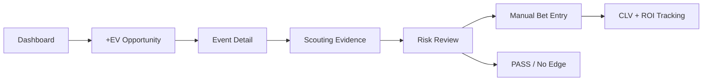

# UX Design Specification: FIND THE EDGE

## 1. Purpose

This specification translates the Claude Design prototype into implementation-ready UX guidance for the React MVP. The prototype is the primary visual reference, but it does not override the Product Brief, PRD, or Architecture.

The MVP remains private, soccer-first, Hard Rock Bet Florida-focused, and built around deterministic betting calculations, immutable odds history, provenance, scouting reports, manual bet tracking, ROI, and CLV.

No production React code, infrastructure, dependency installation, or application scaffold is created by this document.

## 2. Prototype Import and Inspection

Imported prototype files:

- `design/claude/Find The Edge.dc.html`
- `design/claude/support.js`

The HTML references the runtime with `./support.js`, which is the correct relative path for local viewing.

### 2.1 Screens Represented in the Prototype

Fully represented high-fidelity screens:

- Dashboard.
- Events Explorer.
- +EV Scanner.
- Scouting Report.
- Bet Tracker.
- Data Sources.
- Design System reference.
- Documentation/reference screen.
- Mobile 390px reference views.

Represented only as navigation placeholders:

- Odds Terminal.
- Watchlist.
- Performance.
- Settings.
- Scouting Reports library separate from the report detail.

Not represented as a full screen:

- Login.
- Forgot password.
- Session-expired login state.
- Event Detail as its own screen.
- Scouting Job State as a standalone progress screen.
- Bet entry drawer/dialog on desktop.
- Provider status detail drawer.

### 2.2 Navigation Represented

The prototype uses a persistent left sidebar on desktop with two groups:

- Terminal: Dashboard, Events, +EV Scanner, Scouting Reports, Odds Terminal, Watchlist, Bet Tracker, Performance, Data Sources, Settings.
- Design: Design System, Mobile 390px, Documentation.

The shell also includes a sticky top header with route title, route subtitle, global search affordance, Eastern Time clock, Refresh action, and Add Bet action.

Implementation should keep the Terminal navigation group for the product. The Design group is prototype-only and must not ship in the MVP application.

### 2.3 Layout Structure

The visual structure is a desktop-first analytics terminal:

- 244px sticky sidebar.
- 60px sticky top header.
- Scrollable main content area.
- Max-width content containers around 1320-1400px for dense screens.
- Charcoal cards and tables on a near-black background.
- Dense grids for KPIs, opportunities, scanner rows, event tables, provider rows, and bet rows.
- Horizontal scrolling for wide data tables.
- Sticky report section navigation for long-form scouting reports.

### 2.4 Reusable Components Observed

- App shell.
- Crown logo lockup.
- Sidebar navigation item with active rail and optional badge.
- Header search field.
- Refresh button with spin state.
- Primary gradient action button.
- KPI/stat tile.
- +EV opportunity card.
- Dense scanner table row.
- Filter chip.
- Segmented table/card view toggle.
- Event table row and event card.
- Report version selector.
- Sticky report section nav item.
- Report section panel.
- Status badge.
- Freshness badge.
- Confidence meter.
- Sportsbook odds cell.
- Bet tracker status chip.
- Provider health row.
- Quota bar.
- Toast.
- Mobile phone-frame reference card.

### 2.5 Prototype Interactive Behavior

`support.js` is a generated Claude Design runtime. The prototype's embedded script implements demo behavior:

- Route changes through local component state.
- Sidebar navigation updates the visible screen.
- Scanner sorting by EV, confidence, and kickoff.
- Events table/card toggle.
- Scouting report version switching with toast messages.
- Sticky report section links that scroll to sections.
- Bet Tracker filtering by status.
- Add Bet actions that show toasts and navigate to Bet Tracker.
- Refresh action with spinner and toast.
- Provider configure button toast.
- Demo-only odds math for visual values.

Implementation must not reuse this runtime or embedded prototype logic as production code. All authoritative betting calculations belong in the pure domain package described by the Architecture.

## 3. Design Vision

FIND THE EDGE should feel like a premium sports intelligence terminal: dark, fast, analytical, and controlled. It should communicate confidence without hype. The user should be able to answer within seconds:

Where is the edge right now, and why does the system believe it exists?

The product experience should move from:

Dashboard -> Qualified opportunity -> Event and market comparison -> Scouting evidence -> Risk review -> Manual bet entry -> CLV and result tracking.

Design principles:

- Dense but readable.
- Evidence before persuasion.
- PASS and no-edge states are successful outcomes.
- Green is reserved for verified positive EV or positive process outcomes.
- Red communicates errors, stale data, risk, negative movement, and losses.
- Amber communicates warning, aging, incomplete, or pending data.
- Purple carries brand, target emphasis, active navigation, and primary action.
- Probability, confidence, expected value, and data quality must be visually distinct.
- The interface must not resemble a casino, sportsbook promotion, or picks-selling product.

## 4. Information Architecture

Product IA:

```text
App Shell
  Login
  Dashboard
  Events
    Event Detail
      Event Odds
      Odds History
      Scouting Job State
      Scouting Report
      Report Versions
  +EV Scanner
  Scouting Reports
    Report Detail
    Version History
  Odds Terminal
  Watchlist
  Bet Tracker
    Bet Entry
    Settlement
  Performance
  Data Sources
  Settings
```

Primary navigation order:

1. Dashboard.
2. Events.
3. +EV Scanner.
4. Scouting Reports.
5. Odds Terminal.
6. Watchlist.
7. Bet Tracker.
8. Performance.
9. Data Sources.
10. Settings.

Navigation model:

- Desktop and laptop: persistent left sidebar plus sticky top header.
- Tablet: sidebar collapses to an icon rail or drawer; top header remains.
- Mobile: bottom navigation for Edge, Scanner, Reports, Bets; secondary routes move behind a menu.

Rationale: The product is a repeated-use analytical tool with many peer surfaces. Sidebar navigation supports fast switching between terminal-like surfaces without burying tools in top navigation.

## 5. Main User Journey

Kevishie signs in and lands on Dashboard. He scans ranked Active +EV Opportunities and sees the top edge with Hard Rock odds, best comparison odds, no-vig fair odds, EV, confidence, book count, freshness, and warnings. He opens the event, checks the sportsbook comparison and scouting summary, reviews Market Edge and Risk Assessment, then either passes or adds a bet. If he adds a bet, the Bet Tracker entry carries the opportunity/report source. After the event, he settles the bet and reviews CLV, ROI, and process quality.

Climax: the user understands not only that an opportunity exists, but why it exists, whether the data is fresh, and whether the risk/context supports action.

## 6. Screen Inventory and Behavior

### 6.1 Login

Prototype status: missing.

Required MVP behavior:

- Show FIND THE EDGE crown branding.
- Email and password fields.
- Sign in button.
- Forgot password link.
- Invalid credentials state.
- Loading state.
- Session-expired state.
- Private-platform messaging.
- No public registration.

Implementation guidance:

- Use a centered auth panel on near-black background.
- Keep copy restrained: "Private sports betting intelligence for Kevishie."
- Session-expired copy should say "Session expired. Sign in again to continue."

### 6.2 Dashboard

Prototype status: fully represented.

Purpose: answer "Where is the edge right now?"

Required content:

- KPI tiles: Active +EV, Highest EV, Open Exposure, Recent CLV.
- Ranked top +EV opportunities.
- Hard Rock discrepancies.
- Upcoming watched events.
- Recent line movement.
- Recently completed reports.
- Provider status and quota summary.

+EV opportunity card requirements:

- Event.
- Competition.
- Kickoff time in Eastern Time.
- Market.
- Selection.
- Hard Rock odds.
- Best comparison odds.
- Consensus fair odds.
- Hard Rock implied probability.
- Estimated fair probability.
- Estimated EV.
- Confidence.
- Contributing book count.
- Last updated timestamp.
- Freshness status.
- Warning badges.
- Open Event action.
- Add Bet action.

Behavior:

- Open Event navigates to Event Detail, not directly to Scouting Report in production.
- Add Bet opens a bet-entry drawer with source prefilled.
- Stale opportunities must not remain in the active ranked list.
- No edge found is a valid Dashboard state.

### 6.3 Events Explorer

Prototype status: represented with table and card view.

Use a dense table as the primary desktop view. The card view is useful for tablet/mobile or quick scanning, but the table is better for comparing kickoff, availability, report status, lineup status, and actions across events.

Required filters:

- Date navigation.
- Sport filter locked to soccer in MVP.
- Competition.
- Search.
- Watchlist.
- Scouted/unscouted.
- Event status.

Required columns:

- Event.
- Kickoff time in Eastern Time.
- Event status.
- Hard Rock market availability.
- Comparison-book coverage.
- Report status.
- Lineup status.
- Freshness.
- Scout Event action.
- Add to Watchlist action.

Behavior:

- Scout Event creates or opens the scouting job state.
- Open Report appears when a completed report exists.
- Missing Hard Rock coverage must be visible, not hidden.

### 6.4 Event Detail

Prototype status: missing as a distinct screen.

Required layout:

- Header: teams, competition, kickoff, event status, Watchlist control, Scout Event, Refresh Odds.
- Data readiness strip: venue, weather, injury, lineup, odds freshness.
- Current qualified opportunities.
- Available markets and sportsbook comparison.
- Odds history.
- Scouting report summary.
- Report versions.
- Data sources and timestamps.

Within seconds, the user should know:

- Which Hard Rock prices may be mispriced.
- Estimated edge size.
- Whether the data is fresh.
- Whether the event has been fully scouted.

### 6.5 Scouting Job State

Prototype status: partially implied, not represented as its own workflow.

Required states:

- Not scouted.
- Queued.
- Collecting data.
- Generating report.
- Calculating edges.
- Complete.
- Failed.
- Partial data.
- Retry available.

Use user-friendly labels, not AWS terminology. Example: "Collecting provider data" instead of "Step Functions running."

### 6.6 Scouting Report

Prototype status: represented in high fidelity.

Required section order:

1. Match Snapshot.
2. Venue & Weather.
3. Team Scouting.
4. Tactical Matchup.
5. Player Matchups.
6. X-Factor / Cinderella Check.
7. Betting Market Analysis.
8. Line Movement.
9. Advanced Metrics.
10. Historical Trends.
11. Market Edge.
12. Risk Assessment.
13. Final Plays.
14. Nuke or Pass.

Required behavior:

- Sticky section navigation.
- Collapsible sections in implementation, even though the prototype mainly shows expanded panels.
- Report version selector.
- Change indicators between versions.
- Source citations.
- Collected timestamps.
- Verified, inferred, stale, and unavailable statuses.
- Confidence.
- Data warnings.
- Structured market verdicts.
- Final recommendations.
- PASS state when no sufficient edge exists.

Distinctions:

- Verified facts use provenance badges and citations.
- Deterministic calculations are rendered as calculation outputs with algorithm/version metadata when expanded.
- AI-assisted interpretation is labeled as interpretation and must cite verified inputs.

### 6.7 +EV Scanner

Prototype status: represented in high fidelity.

Required filters:

- Competition.
- Date and kickoff window.
- Market.
- Target sportsbook.
- Minimum EV.
- Minimum confidence.
- Minimum contributing books.
- Maximum odds age.
- Watchlist.
- Scouted/unscouted.
- Active, stale, suspended, or closed status.

Required sorting:

- EV.
- Kickoff.
- Confidence.
- Line movement.
- Market disagreement.
- Freshness.

Implementation notes:

- Use TanStack Table.
- Keep horizontal density.
- Saved filters/presets may be represented as simple filter chips in MVP, not a full saved-filter manager.
- Player props shown in prototype data are not MVP and must be removed from MVP seed/demo data.

### 6.8 Odds Terminal

Prototype status: navigation placeholder plus reusable odds matrix logic in embedded script; not a full visible screen.

Required columns:

- Event.
- Market.
- Selection.
- Hard Rock Florida.
- DraftKings.
- FanDuel.
- BetMGM.
- Caesars.
- Fanatics.
- Best price.
- Market average.
- No-vig fair odds.
- Opening price.
- Current movement.
- Last updated.

Required behavior:

- Emphasize target sportsbook.
- Highlight best price.
- Warn on stale prices.
- Show suspended and missing market states.
- Expand odds-history chart.
- Show market disagreement indicator.
- Show provider timestamp details through row expansion or source drawer.

### 6.9 Watchlist

Prototype status: navigation placeholder and Dashboard watched-event module.

Required content:

- Watched events.
- Time until kickoff.
- Current Hard Rock odds.
- Opportunity status.
- Report status.
- Changes since last visit.
- Significant line movement.
- Lineup status.
- Remove action.
- Scout action.

### 6.10 Bet Tracker

Prototype status: represented in high fidelity.

Required behavior:

- Manual bet entry.
- Link bet to +EV opportunity or scouting recommendation.
- Filter by status.
- Open, Won, Lost, Push, Void, Cashed Out states.
- Show potential payout, final payout, profit/loss, closing odds, and CLV.

Desktop bet entry should be a drawer or dialog launched from Add Bet. Mobile bet entry should use a full-height sheet.

### 6.11 Performance

Prototype status: navigation placeholder and Dashboard/Bet Tracker summary metrics.

Required content:

- Profit.
- ROI.
- CLV.
- Win rate.
- Average odds.
- Average estimated EV.
- Bets placed.
- Performance by market.
- Performance by competition.
- Performance by confidence.
- Recommended versus manual bets.
- Time-series performance.
- Calibration summary when sufficient data exists.

Emphasis:

- ROI and CLV outrank win rate.
- Insufficient sample sizes get a neutral caution state.

### 6.12 Data Sources

Prototype status: represented in high fidelity.

Required content:

- Provider.
- Purpose.
- Connection status.
- Last successful sync.
- Last error.
- Quota remaining.
- Request usage.
- Supported data.
- Freshness.
- Configuration status.

Do not expose API keys. Prototype provider names such as API-Football, OpenWeather, SportRadar Injuries, and Hard Rock Feed are visual examples only; the soccer enrichment provider remains unresolved.

### 6.13 Settings

Prototype status: navigation placeholder.

Required content:

- Target sportsbook.
- Comparison sportsbooks.
- Bookmaker weights.
- Minimum EV threshold.
- Maximum odds age.
- Minimum contributing books.
- Fractional Kelly setting.
- Display timezone.
- Enabled competitions.
- Enabled markets.
- Future automatic scouting preferences.
- User profile.
- Password and security.

Automatic scouting settings are future-facing and must not imply scheduled scouting is active in MVP.

## 7. Low-Fidelity Wireframes

### 7.1 Desktop Shell

```text
+----------------------+------------------------------------------------+
| Sidebar              | Header: title / search / ET clock / refresh     |
| - Dashboard          +------------------------------------------------+
| - Events             |                                                |
| - +EV Scanner        | Main content                                    |
| - Reports            | - page-specific filters                         |
| - Odds Terminal      | - dense table/cards                             |
| - Watchlist          | - source/freshness/status surfaces              |
| - Bet Tracker        |                                                |
| - Performance        |                                                |
| - Data Sources       |                                                |
| - Settings           |                                                |
+----------------------+------------------------------------------------+
```

### 7.2 Core Decision Loop



### 7.3 Mobile Priority

```text
Mobile bottom tabs:
Edge | Scanner | Reports | Bets

Mobile screen priority:
1. Active edge / no-edge state
2. Event status and freshness
3. Current odds and EV
4. Report verdict and sources
5. Add bet / settle bet
```

## 8. Visual Direction and Tokens

### 8.1 Color Tokens

| Token | Value | Use |
| --- | --- | --- |
| `bg.base` | `#0A0A0D` | App background |
| `bg.sidebar` | `#0C0C10` | Sidebar and chrome |
| `bg.panel` | `#111015` | Cards, panels |
| `bg.raised` | `#1B1A22` | Raised controls, filters |
| `bg.input` | `#131319` | Inputs, search |
| `border.default` | `#201E29` | Panel borders |
| `border.strong` | `#2A2833` | Control/table borders |
| `text.primary` | `#F3F1F8` | Main text |
| `text.secondary` | `#CFCADA` | Body/supporting |
| `text.muted` | `#A29DAF` | Muted labels |
| `text.subtle` | `#6B6678` | Metadata |
| `brand.purple` | `#8B5CF6` | Crown, active rail |
| `brand.neon` | `#A855F7` | Primary action, active nav |
| `brand.neonLight` | `#C084FC` | Hover/accent |
| `semantic.positiveEV` | `#34D399` | Verified positive EV, positive CLV |
| `semantic.error` | `#F87171` | Errors, stale hard fail, negative movement |
| `semantic.warning` | `#FBBF24` | Aging, incomplete, pending |
| `semantic.inferred` | `#38BDF8` | Inferred/AI-assisted metadata |
| `semantic.unavailable` | `#6B6678` | Unavailable/disabled |

Green is reserved for verified positive EV and positive performance signals. Do not use green as generic success decoration.

### 8.2 Typography

- Display: Anton, used for brand, page headings, large EV values, and verdicts.
- UI/body: Space Grotesk, used for navigation, labels, cards, tables, and forms.
- Numeric/metadata: IBM Plex Mono, used for odds, percentages, timestamps, statuses, IDs, and compact labels.

Implementation should load equivalent web fonts or define fallbacks if licensing/performance requires.

### 8.3 Spacing, Radius, and Elevation

- Spacing scale: 4, 8, 10, 12, 14, 16, 18, 20, 24, 28.
- Radius: 5px badges, 7-9px controls, 10-12px cards, 14px hero/opportunity panels.
- Borders are the main depth mechanism.
- Shadows are restrained and used mainly for purple/green glow emphasis.
- Neon glow is permitted for active brand marks, primary CTA, and verified EV emphasis only.

### 8.4 Motion

- Use short fade/rise transitions for screen entry.
- Refresh icon may spin during refresh.
- Provider live dot may pulse.
- Toasts may slide/fade in.
- Avoid flashing animation.
- Respect reduced-motion preferences.

## 9. Component Inventory

Map components to shadcn/ui, TanStack Table, and Recharts where practical.

| Component | Implementation Direction |
| --- | --- |
| App shell | Custom layout with shadcn `ScrollArea` where useful |
| Sidebar nav | Custom nav + router links |
| Header search | shadcn `Input` / future command palette |
| Buttons | shadcn `Button` variants with brand tokens |
| Icon buttons | shadcn `Button` icon size |
| Inputs/selects | shadcn `Input`, `Select`, `Popover`, `Command` |
| Date controls | shadcn `Popover` + calendar or simple segmented controls |
| Tabs/segmented controls | shadcn `Tabs` or Toggle Group |
| Tables | TanStack Table with custom cells |
| Cards | shadcn `Card` adapted to dark terminal tokens |
| Stat tiles | Custom card primitive |
| Badges | shadcn `Badge` variants |
| Tooltips/popovers | shadcn `Tooltip`, `Popover` |
| Drawers/dialogs | shadcn `Sheet`, `Dialog` |
| Toasts | shadcn `Toast`/Sonner-style toast |
| Pagination | Cursor-based control component |
| Charts | Recharts line/bar components |
| Empty states | Custom state panel |
| Skeletons | shadcn `Skeleton` |
| Freshness indicators | Badge + timestamp + tooltip |
| Confidence indicators | Meter + label + explanation tooltip |
| EV indicators | Numeric token + provenance/freshness context |
| Sportsbook odds cells | Custom table cell component |
| Market comparison rows | TanStack row composition |
| Scouting-section headers | Sticky anchor/nav + collapsible section |
| Source citations | Inline citation pill + side drawer |

## 10. State Patterns

Reusable states:

- Loading: skeletons matching the eventual layout.
- Empty: explain whether no data exists, no filter matches, or no edge qualifies.
- Error: red state with safe message and retry when possible.
- Partial data: amber state with missing provider fields listed.
- Stale data: amber or red depending severity, always with timestamp.
- Provider unavailable: red provider badge and stale cache notice.
- Provider quota low: amber quota badge and reduced polling copy.
- Market suspended: red/suspended badge; exclude from active qualification.
- Market unavailable: muted unavailable badge.
- No edge found: neutral/successful PASS state.
- No reports: prompt to Scout Event.
- Scouting queued/running/failed: progress states with retry where allowed.
- Official lineups pending/confirmed: amber/green labels.
- Event postponed/canceled/started/final: explicit event status labels.

PASS state guidance:

- PASS is not a failure.
- Use calm copy: "No qualified edge. Data is fresh; thresholds were not met."
- Show top disqualification reasons.

## 11. Data Provenance UX

Visual language:

- Verified: green badge with source available.
- Inferred: blue badge, never used for core factual claims unless clearly labeled.
- Stale: amber badge for aging, red when unsafe for active use.
- Unavailable: muted badge.
- Provider-backed: source pill with provider name.
- Deterministic calculation: mono "calc" badge with algorithm/version in details.
- AI-assisted analysis: blue/purple interpretation badge with citations.

Progressive disclosure:

- Default views show concise status, freshness, and confidence.
- Tooltips explain badge meaning.
- Row expansion shows source, Provider Timestamp, Collection Timestamp, freshness, confidence, and verification.
- Report source panels show citations and unavailable facts by section.
- Do not display every metadata field at all times.

## 12. Responsive Behavior

Desktop 1440px:

- Persistent 244px sidebar.
- Sticky 60px header.
- Multi-column dashboard.
- Full scanner and terminal tables.
- Scouting report uses left sticky section nav.

Laptop 1280px:

- Same model with tighter gutters.
- Avoid reducing table font below readable sizes; use horizontal scroll.

Tablet 768px:

- Sidebar collapses to icon rail or drawer.
- Dashboard stacks to one/two columns.
- Tables remain horizontally scrollable.
- Report section nav becomes sticky top horizontal nav or drawer.

Mobile 390px:

- Do not compress full odds terminal.
- Use bottom nav: Edge, Scanner, Reports, Bets.
- Prioritize active edges, event status, odds, report verdict, and bet entry.
- Use full-width cards and sheets.
- Hide low-priority columns behind drill-in/detail screens.

## 13. Accessibility Requirements

- Target WCAG 2.1 AA.
- Keyboard navigation must reach all actions, filters, rows, tabs, report sections, drawers, and dialogs.
- Visible focus ring using purple token with sufficient contrast.
- Status must not rely on color alone; use text/icon plus color.
- Tables need semantic headers, sortable controls with aria labels, and row action labels.
- Charts require text alternatives and data tables.
- Toasts and provider/status changes should use polite live regions.
- Destructive or stale-data warnings should be announced without trapping focus.
- Motion respects `prefers-reduced-motion`.
- Touch targets on mobile should be at least 44px where practical.

## 14. Developer Handoff Notes

- Keep prototype files as reference only; do not import `support.js` into the app.
- Recreate UI with React, Vite, TanStack Router, TanStack Query, TanStack Table, Tailwind, shadcn/ui, and Recharts.
- Do not place authoritative betting calculations in React components.
- Use TanStack Query for server state and explicit stale states.
- Use TanStack Table for Scanner, Events, Odds Terminal, Bet Tracker, and Performance tables.
- Use Recharts only for charts, not tabular numeric truth.
- Use route-level error boundaries for provider unavailable and auth-expired cases.
- Use typed response envelopes and Zod validation at API boundaries.
- Preserve source/provenance affordances in every screen that displays factual sports or odds data.

## 15. Prototype Gaps and Conflicts

Features shown in prototype:

- Dashboard.
- Events Explorer.
- +EV Scanner.
- Scouting Report.
- Bet Tracker.
- Data Sources.
- Design System.
- Mobile reference.
- Documentation reference.

MVP features required but not fully shown:

- Login and password reset.
- Event Detail.
- Scouting Job State flow.
- Odds Terminal full screen.
- Watchlist full screen.
- Performance full screen.
- Settings full screen.
- Scouting Reports library.
- Desktop Bet Entry drawer/dialog.
- Empty, error, and no-edge states as full surfaces.

Decorative prototype elements:

- Design System and Documentation nav group.
- Mobile phone frames.
- Demo crown/Florida watermark styling.
- Demo flags and tournament data.
- Demo toasts.

Functional behavior that must be implemented:

- Auth flow.
- Protected routing.
- Data-driven navigation and filters.
- Server-state loading/stale/error handling.
- Deterministic odds and EV calculations from backend/domain outputs.
- Add Bet source linkage.
- Report versioning and citations.
- Provider health and quota status.

Important conflicts or corrections:

- Prototype includes player props and provider examples beyond MVP; MVP excludes player props and keeps soccer enrichment provider unresolved.
- Prototype documentation mentions automatic scouting as scheduled; MVP only stores future automatic scouting preferences.
- Prototype uses demo in-component betting math; production must use pure deterministic domain calculations outside React.
- Prototype navigates some Open Event actions directly to Scouting Report; implementation should route through Event Detail when available.
- Prototype uses sample provider names such as API-Football and SportRadar Injuries; these are visual examples, not vendor decisions.

## 16. Open UX Decisions

- Should Event Detail or +EV Scanner be the primary landing surface after clicking a Dashboard opportunity?
- How much provenance should be visible inline versus in a source drawer on mobile?
- Should the MVP include a command palette/search overlay or keep global search as a simple field?
- What exact PASS/no-edge copy should be standardized across Dashboard, Event Detail, and Report?
- Should confidence be numeric, bucketed, or both?
- Should fractional Kelly be visible by default or tucked into advanced details?
- Which Performance charts are most useful before sample size is meaningful?
- How should Settings communicate future automatic scouting without implying it is active?

## 17. Recommended Implementation Order

1. Auth shell and app navigation.
2. Dashboard layout with no-edge, stale, and provider-unavailable states.
3. Events Explorer table and filters.
4. +EV Scanner table and opportunity row/card components.
5. Event Detail and odds comparison modules.
6. Scouting Job State and Scouting Report.
7. Bet Entry and Bet Tracker.
8. Data Sources.
9. Odds Terminal.
10. Watchlist.
11. Performance.
12. Settings.

First screen to implement: Dashboard. It validates the core product question, visual language, navigation shell, provider status, opportunity card pattern, freshness/provenance rules, and the Add Bet/Open Event decision loop.

## 18. Review Checklist

- Product Brief alignment: confirmed.
- PRD alignment: confirmed.
- Architecture alignment: confirmed.
- Soccer-first MVP: preserved.
- Deterministic/provider/AI distinction: explicit.
- Data freshness and provenance: visible through badges and progressive disclosure.
- PASS and no-edge states: treated as successful outcomes.
- Casino aesthetics: avoided.
- Stack compatibility: React, Vite, TanStack Router, TanStack Query, TanStack Table, Tailwind, shadcn/ui, and Recharts.
- Production application code: not added.
